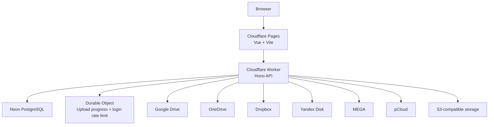

<p align="center">
  
</p>

# OmniCloud

OmniCloud is a cloud-drive aggregation platform that brings multiple storage providers into one workspace. The project includes a Vue frontend, a legacy Node/Express backend for local/self-hosted use, and a Cloudflare Worker/Pages deployment path for the hosted `cloudflare-test` branch.

> **Hosted test deployment:** `cloudflare-test` → Cloudflare Pages + Cloudflare Worker + Neon PostgreSQL.
>
> **Important:** secrets are never stored in the repository. Use GitHub Actions Secrets / Cloudflare Worker Secrets for hosted deployments.

## ✨ Features

### ☁️ Multi-provider storage
- Google Drive
- OneDrive
- Dropbox
- Yandex Disk
- MEGA
- pCloud
- S3-compatible storage

Provider support depends on the active adapter and its required credentials/OAuth configuration.

### 🗂️ Unified file workspace
- Home, My Drive, Recent, Starred, Shared and Quota views
- Provider-normalized file metadata
- Create folders
- Rename files/folders
- Delete individual or multiple files
- Download files
- Safe previews for explicitly supported MIME types
- Star/unstar where supported by the provider

### ⬆️ Upload system
- Browser uploads
- Folder uploads
- Drag-and-drop uploads
- Upload session initialization
- Provider allocation strategies
- WebSocket upload progress

### 👤 Authentication
- Local/self-hosted mode
- Hosted multi-user mode
- Session cookies with `HttpOnly`, `Secure` and `SameSite`
- Password hashing using `scrypt`
- Persistent session token hashing
- OAuth state protection for supported providers
- Login rate limiting in the Cloudflare Worker deployment

### ⚙️ Storage allocation
Supported strategies include:
- `round_robin`
- `weighted_round_robin`
- `least_used`
- `most_free`
- `manual`

## ☁️ Hosted Cloudflare architecture

The `cloudflare-test` branch uses a serverless deployment instead of keeping the API process alive on Render:



### Hosted components

| Component | Hosted role |
| --- | --- |
| Cloudflare Pages | Frontend hosting |
| Cloudflare Worker | API/auth/provider orchestration |
| Cloudflare Durable Object | Upload progress and login rate limiting |
| Neon PostgreSQL | Hosted application metadata/auth/session database |
| Cloud provider APIs | Actual user file storage |

The hosted path is designed to avoid the idle-sleep behavior of a traditional free Render Web Service.

## 🌐 Hosted test deployment

Current test hostname:

**https://omnicloud-4u.pages.dev/**

The `4U` name is intentional: **OmniCloud for you**.

The hosted deployment lives on the `cloudflare-test` branch so it can be tested without modifying `main`.

## 🏗️ Repository structure

```text
OmniCloud/
├─ frontend/                    # Vue 3 + Vite frontend
├─ backend/                     # Express/local backend and migration tools
├─ worker/                      # Cloudflare Worker API
│  ├─ src/                      # Worker routes, auth, providers, Durable Object
│  ├─ schema.sql                # PostgreSQL schema used by the hosted worker
│  └─ wrangler.toml             # Worker configuration
├─ pages/                       # Cloudflare Pages deployment bundle/config
├─ functions/                   # Pages/Functions integration code
├─ docs/                        # Provider setup documentation
├─ .github/workflows/           # CI/CD and Cloudflare deployment workflows
└─ README.md
```

## 🔄 Hosted data migration

The hosted branch was migrated from the SQLite snapshot used by the legacy application into Neon PostgreSQL.

The migration process:

1. Reads the SQLite snapshot stored for the Cloudflare migration
2. Creates the PostgreSQL schema
3. Migrates users, sessions, cloud-account metadata, file metadata and user settings
4. Verifies migration parity before deployment
5. Leaves the original SQLite snapshot untouched

Authentication sessions are treated as ephemeral deployment state during parity checks because test logins can create additional sessions after migration.

## 🔐 Hosted security model

The hosted branch includes additional hardening for the Worker/Pages deployment:

- Provider credentials are encrypted with AES-256-GCM before storage
- Encryption requires `ENCRYPTION_KEY`; there is no development-secret fallback in the Worker
- Session hashing uses a separate derived `AUTH_SECRET`
- API responses do not expose `encrypted_credentials`
- API responses are marked `no-store`
- Security headers include HSTS, CSP, `X-Content-Type-Options`, `X-Frame-Options`, COOP and CORP
- File previews only use `inline` for an explicit allowlist of safe MIME types
- Other file types are forced to download as `application/octet-stream`
- Login attempts are rate-limited using a Durable Object
- WebSocket upload endpoints verify authentication and the request origin
- SQL queries use parameterized/tagged query interfaces
- File/account queries are scoped to the authenticated user's ID
- GitHub Actions workflows use read-only repository permissions

### Secret handling

Never commit or paste any of these into the repository:

- Cloudflare API tokens
- Neon database URLs
- Encryption keys
- Session/auth secrets
- OAuth client secrets
- Provider passwords, access keys or refresh tokens

For the hosted deployment, repository secrets are injected through GitHub Actions and then stored as Cloudflare Worker Secrets.

## 🔑 GitHub Actions secrets used by the hosted deployment

The hosted deployment expects repository secrets for values such as:

```text
CLOUDFLARE_ACCOUNT_ID
CLOUDFLARE_API_TOKEN
NEON_DATABASE_URL
OMNICLOUD_ENCRYPTION_KEY
```

Provider-specific OAuth secrets may be supplied when those providers are enabled.

**Do not put secret values in this README or in `.env` files committed to Git.**

## 📦 Local development

### Requirements

- Node.js 20+
- npm
- Provider credentials for any services you want to test

### Install

```bash
npm install
```

### Configure local environment

Copy the template:

```powershell
copy backend/.env.example backend/.env
```

Then configure the required values for local/self-hosted development.

Example:

```env
PORT=8787
APP_MODE=local
CORS_ORIGIN=http://localhost:5173
FRONTEND_URL=http://localhost:5173
SYNC_INTERVAL_MINUTES=5
AUTH_COOKIE_NAME=omnicloud_session
AUTH_SESSION_TTL_HOURS=336
AUTH_SECRET=replace-with-a-strong-random-secret
ENCRYPTION_KEY=replace-with-a-strong-random-key

GOOGLE_CLIENT_ID=
GOOGLE_CLIENT_SECRET=
GOOGLE_REDIRECT_URI=http://localhost:8787/api/accounts/google/callback

ONEDRIVE_CLIENT_ID=
ONEDRIVE_CLIENT_SECRET=
ONEDRIVE_TENANT_ID=common
ONEDRIVE_REDIRECT_URI=http://localhost:8787/api/accounts/onedrive/callback

DROPBOX_CLIENT_ID=
DROPBOX_CLIENT_SECRET=
DROPBOX_REDIRECT_URI=http://localhost:8787/api/accounts/dropbox/callback

YANDEX_CLIENT_ID=
YANDEX_CLIENT_SECRET=
YANDEX_REDIRECT_URI=http://localhost:8787/api/accounts/yandex/callback
```

Use `backend/.env.example` as the source of truth for the full local configuration.

### Run locally

```bash
npm run dev
```

Default endpoints:

- Frontend: `http://localhost:5173`
- Legacy API: `http://localhost:8787`

## 🐳 Docker

The repository also contains Docker support for the legacy/local stack.

```bash
docker compose up --build
```

Default local Docker frontend:

```text
http://localhost:8080
```

Stop the stack:

```bash
docker compose down
```

## 🛠️ Scripts

### Root

| Script | Purpose |
| --- | --- |
| `npm run dev` | Run frontend and backend together |
| `npm run build` | Build the frontend |
| `npm run build:web` | Build the frontend only |
| `npm run dev:web` | Start Vite |
| `npm run dev:api` | Start the legacy API in watch mode |
| `npm start` | Start the legacy backend |

### Frontend

| Script | Purpose |
| --- | --- |
| `npm --prefix frontend run dev` | Vite development server |
| `npm --prefix frontend run build` | Production frontend build |
| `npm --prefix frontend run preview` | Preview production build |

### Backend

| Script | Purpose |
| --- | --- |
| `npm --prefix backend run dev` | Legacy API with file watching |
| `npm --prefix backend start` | Legacy API without watch mode |

## 🔌 Hosted API overview

### Health/auth

```text
GET  /api/health
GET  /api/auth/me
POST /api/auth/login
POST /api/auth/logout
```

### Accounts

```text
GET    /api/accounts
DELETE /api/accounts/:id
GET    /api/accounts/<provider>/status
GET    /api/accounts/<provider>/connect
POST   /api/accounts/mega/connect
POST   /api/accounts/pcloud/connect
POST   /api/accounts/s3/connect
```

OAuth callback routes are exposed below `/api/accounts/*/callback` for supported providers.

### Files

```text
GET    /api/files
GET    /api/files/:id
PATCH  /api/files/:id/star
PATCH  /api/files/:id/rename
DELETE /api/files/:id
POST   /api/files/bulk/delete
POST   /api/files/folders
GET    /api/files/:id/download
GET    /api/files/:id/preview
POST   /api/sync/run
```

### Uploads

```text
POST /api/uploads/initiate
POST /api/uploads/:uploadId/stream
WS   /ws/uploads?uploadId=...
```

### Settings/allocation

```text
GET   /api/settings
PATCH /api/settings
GET   /api/allocation
PATCH /api/allocation
```

## 🗄️ Storage model

The hosted deployment uses PostgreSQL/Neon for application metadata and authentication state.

The legacy/local deployment may use SQLite for local metadata persistence.

Provider file contents remain in the connected cloud provider itself; OmniCloud stores metadata and encrypted provider credentials needed to access those accounts.

## 📋 Development notes

- Keep `main` stable; use `cloudflare-test` for Cloudflare migration/testing work.
- Do not copy production secrets into the repository.
- Do not expose `.env` files, database files, OAuth credentials, refresh tokens, access keys, or provider passwords.
- Treat provider adapters as security-sensitive code because they handle external credentials and file operations.

## 📄 License

This project is licensed under the [MIT License](LICENSE).
